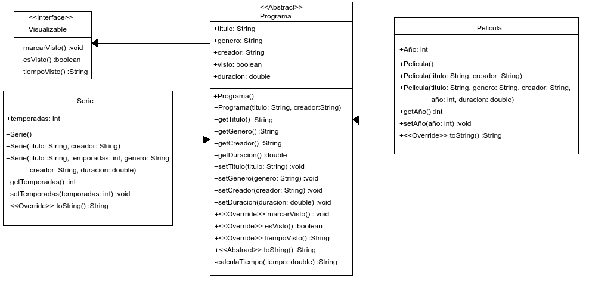

# Proyecto Netflix

Este programa ejemplifica la programación orientada a objetos en [Java], en concreto los conceptos de [herencia], uso de [interfaces], manejo de [excepciones] y uso de la clase [ArrayList]. El programa cuenta con las clases _Pelicula_ y _Serie_, ambas extienden a la [clase abstracta] _Programa_ e implentan a la interfaz _Visualizable_. Los métodos y atributos de cada clase se muestran a continuación en el diagrama de clases:



Por otro lado, la clase principal ejecutable _App_ ejemplifica el uso de las clases anteriores: se declaran cinco series y cinco películas, usando los distintos constructores que se tienen, se usa un [generador de números aleatorios] para escoger al azar algunas películas y series dentro de estas opciones y se muestran sus atributos en pantalla. Al final se muestra también la serie con más temporadas y la película más reciente.

El código se compiló usando [maven] y para ejecutar el programa sólo se requiere tener instalada la [Máquina virtual de Java] (JVM). Para ejecutar el programa en Linux basta con descargar la carpeta _target_, colocarse dentro de ésta y ejecutar:

```sh
java -jar proyecto-1.0.jar
```

La salida del programa puede ser la siguiente (recordemos que el programa no es determinista, salvo por el final donde se muestran la serie con más temporadas y la película más reciente):

```sh
Titulo    : Dumbo
Genero    : Animacion
Creador   : Otto Englander
Año       : 1942
Duración  : 23434,000
Visto     : Sí
Tiempo visto: 350:48 minutos

Titulo    : Amores perros
Genero    : null
Creador   : Guillermo Arriaga
Año       : 0
Duración  : 0,000
Visto     : Sí
Tiempo visto: 0:00 minutos

Titulo               : Sweer tooth
No. de temporadas    : 1
Visto                : Sí
Genero               : null
Creador              : Evan Moore
Duracion             : 0,000
Tiempo visto: 0:00 minutos

Serie con más temporadas: 
Titulo               : Game of thrones
No. de temporadas    : 8
Visto                : No
Genero               : Drama
Creador              : David Benioff
Duracion             : 40276,000

Pelicula más reciente: 
Titulo    : El club de la pelea
Genero    : Accion
Creador   : David Fincher
Año       : 1999
Duración  : 749898,000
Visto     : No

```

Este programa se realizó como parte del curso [Programando con Java para aplicaciones Android].

[Java]: <https://docs.oracle.com/javase/8/docs/technotes/guides/language/index.html>

[herencia]: <https://docs.oracle.com/javase/tutorial/java/IandI/subclasses.html>

[interfaces]: <https://docs.oracle.com/javase/tutorial/java/IandI/createinterface.html>

[excepciones]: <https://docs.oracle.com/javase/tutorial/essential/exceptions/definition.html>

[ArrayList]: <https://docs.oracle.com/javase/8/docs/api/java/util/ArrayList.html>

[clase abstracta]: <https://docs.oracle.com/javase/tutorial/java/IandI/abstract.html>

[generador de números aleatorios]: <https://docs.oracle.com/javase/8/docs/api/java/util/Random.html>

[maven]: <https://maven.apache.org/>

[Máquina virtual de Java]: <https://www.java.com/es/download/help/whatis_java.html>

[Programando con Java para aplicaciones Android]: <https://www.coursera.org/learn/programandoconjava>

